# CNB Currency Converter

[](https://app.netlify.com/projects/currency-converter-cnb/deploys)

A simple React application that converts CZK to foreign currencies using [the latest exchange rates from the Czech National Bank (CNB)](https://www.cnb.cz/en/financial-markets/foreign-exchange-market/central-bank-exchange-rate-fixing/central-bank-exchange-rate-fixing/daily.txt).

The app fetches daily exchange rate data, parses it, and provides a clean UI for browsing rates and converting amounts.

## Assignment

This project was created as part of a technical assignment:

> Create a React app that retrieves CNB exchange rates, displays them, and allows CZK conversion.  
> Use React, TypeScript, Styled Components, and React Query.  
> Include tests and deploy the app.

## Live Demo

Netlify: [currency-converter-cnb.netlify.app](https://currency-converter-cnb.netlify.app)

## Architecture & Key Decisions

### CNB API limitations

The CNB endpoint has several practical limitations:

- Wrong CORS header
- Non-JSON (TXT, CSV-like) format
- Fixed cache TTL (24h), which does not reflect real update time (~14:30 on working days)

### Edge proxy & data transformation

A Netlify Edge Function is used to:

- Proxy the CNB API (CORS workaround)
- Transform TXT data into structured JSON
- Validate data using Zod schemas

### Caching strategy

The CNB API updates exchange rates around 14:30 on working days. The response includes metadata (`nextUpdateAt`) indicating the next scheduled update time.

#### Simple approach

Use a short static TTL (e.g., 5 minutes) - suitable for most use cases.

#### This implementation: multi-layer caching

**1. Edge Function cache (BE)**

The Edge Function caches responses using Netlify's built-in cache with dynamic TTL from API metadata. Useful across different clients hitting the same endpoint - reduces CNB API calls from your infrastructure.

**2. Frontend cache persistence (FE)**

Query cache survives page reloads and browser restarts via localStorage (TanStack Query persistency). Useful for repeated usage of the application by the same user - no network call needed after first fetch. 

When app is opened with stale cached data (nextUpdateAt in the past), the query automatically refetches fresh data. While the app is open, it also auto-refetches when `nextUpdateAt` arrives - so data stays fresh throughout the day.

Only queries with `meta: { persist: true }` are persisted - this opt-in approach allows selective persistence.

Key files:

- [src/api/client.ts](src/api/client.ts) - QueryClient + Persister setup
- [src/api/queryPolicy.ts](src/api/queryPolicy.ts) - Dynamic TTL based on `nextUpdateAt`
- [src/api/useExchangeRates.ts](src/api/useExchangeRates.ts) - Query with metadata

```typescript
// Example: opt-in persistence
useQuery({
  queryKey: ["rates"],
  queryFn: fetchRates,
  meta: { persist: true }, // persists to localStorage
});
```

### Type-safe API contract

Zod schemas (`z.codec()`) are shared between the Edge Function (API) and the frontend, providing static contract testing at runtime.

<picture>
  <source media="(prefers-color-scheme: dark)" srcset="zod-codec-api-dark.svg">
  <source media="(prefers-color-scheme: light)" srcset="zod-codec-api-light.svg">
  
</picture>

## Tech Stack

- React (+ Hooks, Suspense, Error Boundaries, React compiler)
- TypeScript
- TanStack Query (data fetching & caching)
- Zod (runtime validation)
- Styled Components
- Open Props (CSS variables)
- Temporal API (via polyfill)

Testing:

- Vitest (unit + browser tests)
- MSW (API mocking)

Infrastructure:

- Netlify (SPA hosting)
- Netlify Edge Functions (API proxy & transformation)

## Design Notes

This project intentionally explores modern web platform features:

- Customizable `<select>` styling using emerging CSS capabilities
- Temporal API for date/time handling

Some of these features are not yet fully supported across all browsers.  
In a production environment, technology choices would be aligned with target browser support requirements.

## Getting Started

```bash
pnpm install
```

### Create environment variables

```bash
cp .env.example .env
```

Then set the CNB API endpoint:
`CNB_RATES_URL={CNB-API-endpoint-URL}`.
The environment variable is used by the Edge Function to fetch CNB data.

### Development

```bash
pnpm dev
```

---

### Testing

```bash
pnpm test
```
